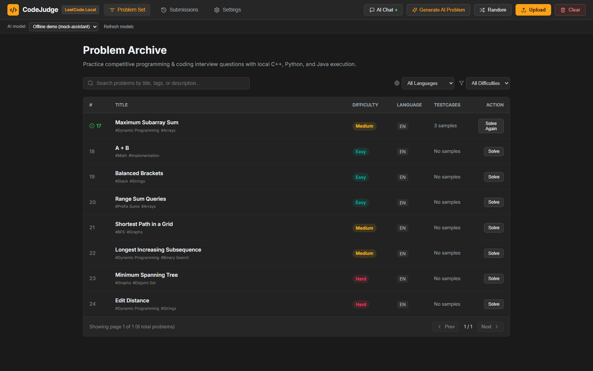
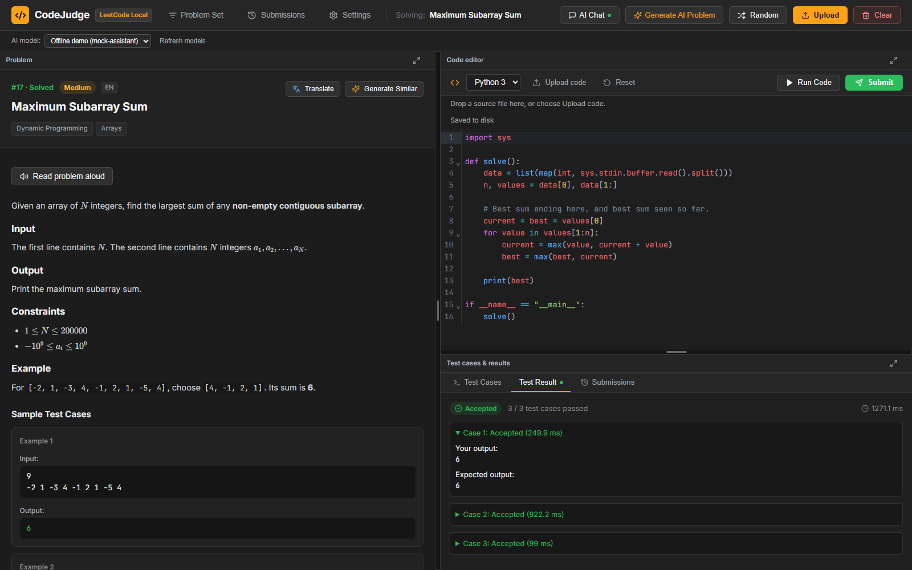
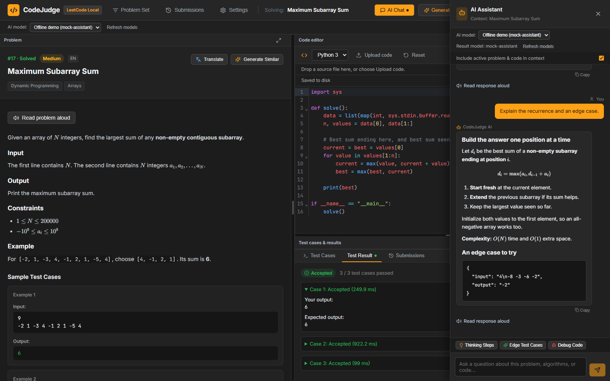
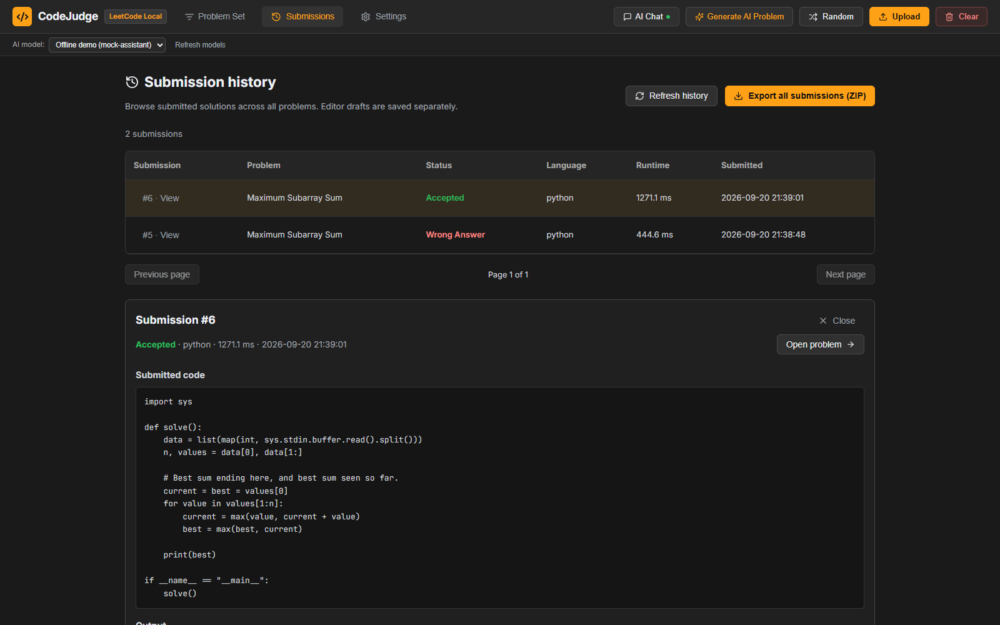

# CodeJudge

CodeJudge is a local competitive programming workspace built with React, Vite,
Flask, and SQLite. Browse problems, write or upload solutions, run test cases,
and track submissions. AI tools provide hints, explanations, and generated
problems, with Markdown and LaTeX rendering and saved speech narration through
The Connector.

Editor drafts save to disk, submission history can be exported as a ZIP, and
the workspace can be shared with devices on your LAN. See
[Models, submissions, and workspace features](docs/llm-and-submissions.md) for
the detailed configuration and API behavior.

## Screenshots

Screenshots use demonstration data.

To refresh these images from the application, run `npm run screenshots` in
`e2e/`. The capture uses an isolated demonstration database and local AI fixtures.

### Problem archive

Search and filter the problem collection, with solved problems marked in green.



### Solving workspace

Read the statement beside the code editor and test console. Resize or expand
panels, upload source files, and save drafts automatically.



### AI assistant

Discuss the current problem with formatted explanations, mathematical formulas,
and code examples. Read-aloud controls generate saved Connector-backed audio.



### Submission history

Review verdicts, submitted code, and test results, or export all submissions.



## Quick start

Windows:

```powershell
.\setup.bat
.\run.bat
```

Linux/macOS:

```bash
./setup.sh
./run.sh
```

If a Python virtual environment or Conda environment is already active, setup
installs into that environment and run uses the same interpreter. Otherwise,
the scripts create and reuse `.venv` in this project.

Start The Connector before CodeJudge. CodeJudge uses its configured
`CONNECTOR_BASE_URL` for both LLM requests and speech. The Connector owns the
Kokoro runtime, voice, language, speed, and device configuration; this project
does not install or launch a separate speech service.

To open CodeJudge from another device on the same LAN, run:

```powershell
.\run_lan.bat
```

Open the printed `LAN: http://<computer-IP>:<port>` address on that device.
The wrapper forwards options, for example `run_lan.bat --frontend-port 5190`.
Its equivalent command is `python run.py serve --lan`, or
`./run.sh serve --lan` on Linux/macOS. The frontend handles API and narration
requests through its local backend proxy. Devices share the same stored data.

Choose the frontend and backend ports independently:

```powershell
# Local access
.\run.bat --frontend-port 8080 --backend-port 8000

# LAN access
.\run_lan.bat --frontend-port 8080 --backend-port 8000
```

The same flags work with `python run.py` and `./run.sh`. Open the printed
frontend address; the API proxy automatically uses the chosen backend port.
Command-line ports override environment variables and `.env` settings. To
remember your choices, set `FRONTEND_PORT=8080` and `BACKEND_PORT=8000` in `.env`.
The legacy `PORT` environment variable takes precedence over `BACKEND_PORT`
when no `--backend-port` is supplied.

The default backend and frontend ports are `3001` and `5173`. The runner checks
both ports before launch and advances to the next available port when needed.
It prints the actual URLs selected for the session. Valid ports are 1–65535;
frontend and backend always receive separate ports. Use `.\run.bat --help`
to list all launcher options.

## Configuration

Copy `.env.example` to `.env` to customize the preferred ports, bind address,
or database path. Environment variables already defined in the terminal take
precedence over values in `.env`.

| Variable | Default | Purpose |
| --- | --- | --- |
| `BACKEND_PORT` | `3001` | First backend port to try |
| `FRONTEND_PORT` | `5173` | First frontend port to try |
| `BACKEND_HOST` | `127.0.0.1` | Backend bind address |
| `DATABASE_PATH` | `backend/data/jira.db` | Single SQLite database shared by projects, stories, problems, submissions, and settings |
| `WORKSPACE_STORAGE_DIR` | `data/workspace/<database-id>` | Saved editor drafts and narration files |
| `CONNECTOR_BASE_URL` | `http://127.0.0.1:8301/v1` | The Connector API for AI and speech requests |
| `CONNECTOR_SPEECH_TIMEOUT_SECONDS` | `180` | Timeout for Connector speech generation |
| `LLM_MODEL` | First discovered model | Active Connector configuration ID |

The application uses one physical SQLite file for both project/story data and
competitive-programming data. On the first unified startup, an existing legacy
problem archive is imported when the unified problem tables are empty. Its
database file is retained as a backup, and missing draft/audio workspace files
are copied without overwriting newer files.

## API

| Method | Path | Behavior |
| --- | --- | --- |
| `GET` | `/api/health` | Backend health check |
| `GET` | `/api/problems` | Browse and search saved problems |
| `POST` | `/api/llm/generate-tags` | Generate and persist tags for up to six untagged problems |
| `POST` | `/api/problems/upload` | Import a problem collection |
| `GET` | `/api/llm/models` | Discover available AI models |
| `POST` | `/api/run` | Execute code with custom input |
| `POST` | `/api/submit` | Judge and save a solution; supports asynchronous jobs |
| `GET` | `/api/submission-jobs/<job-id>` | Poll submission progress and results |
| `GET` | `/api/submissions` | Browse submission history |
| `GET` | `/api/submissions/export.zip` | Download all submissions |
| `POST` | `/api/chat` | Ask the AI assistant |
| `DELETE` | `/api/audio/cache` | Clear saved narration files |

See [Models and submission status](docs/llm-and-submissions.md) for request
formats, draft persistence, and audio endpoints.

## Tests and build

```powershell
python -m unittest discover -s backend\tests -v
python -m unittest discover -s tests -v
cd frontend
npm test
npm run build
cd ..\e2e
npm run typecheck
npm test
```

The Playwright suite starts both Flask and Vite automatically, then exercises
the live API through the frontend proxy using an isolated test database. It
uses Microsoft Edge by default. On macOS it uses Playwright's WebKit-based
Desktop Safari profile, which is the supported automation equivalent for
Safari rendering.

On a fresh macOS checkout, install the WebKit browser once before running the
tests:

```bash
cd e2e
npm run install:webkit
```

## Project layout

```text
backend/                  Flask application, SQLite store, and unit tests
frontend/                 React/Vite application and frontend unit tests
e2e/                      Standalone TypeScript Playwright end-to-end tests
data/workspace/           Saved editor drafts and cached narration (ignored)
docs/                     Feature documentation and application screenshots
tests/                    Root setup and launcher tests
setup.py / setup.*        Cross-platform dependency setup
run.py / run.*            Combined backend/frontend runner
run_lan.bat               Windows launcher for LAN access
```
